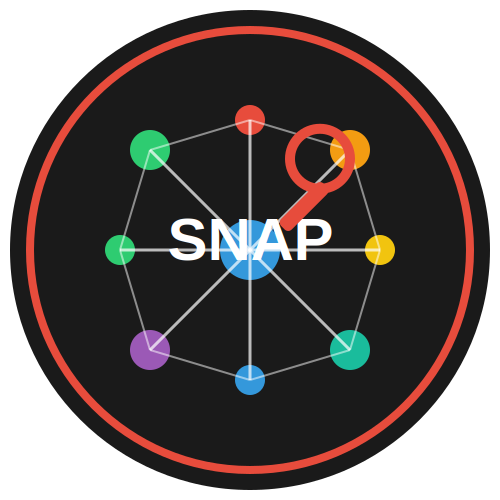

# SNAP - Social Network Analysis and Profiling Tool

<p align="center">
  
</p>

## Overview

SNAP is a powerful OSINT (Open Source Intelligence) tool designed for gathering information about social media profiles. It helps security researchers and penetration testers collect publicly available information from various social networks.

**Developer**: SayersLinux  
**Email**: SayerLinux@gmail.com

## ⚠️ Disclaimer

This tool is provided for educational and research purposes only. The use of SNAP to gather information without prior mutual consent may be illegal in your country. The developer is not responsible for any misuse or damage caused by this tool. Always use responsibly and ethically.

## Features

- Gather information from multiple social networks (Instagram, Facebook, Twitter, Snapchat)
- Extract email addresses associated with profiles
- Find phone numbers linked to usernames
- Retrieve Snapchat profile details, follower counts, posts, and last active status
- Stealth mode to avoid detection
- Detailed reporting of findings
- Linux-optimized performance

## Requirements

- Linux operating system
- Python 3.6+
- Internet connection
- Required Python packages (see requirements.txt)

## Installation

```bash
# Clone the repository
git clone https://github.com/SayersLinux/snap.git

# Navigate to the directory
cd snap

# Install required packages
pip install -r requirements.txt

# Make the script executable
chmod +x snap.py
```

## Usage

```bash
# Basic usage
./snap.py -u <username>

# Enable stealth mode
./snap.py -u <username> -s

# Save results to a file
./snap.py -u <username> -o results.json

# Enable verbose output
./snap.py -u <username> -v

# Specify platforms to analyze
./snap.py -u <username> -p instagram,twitter
```

### Command Line Arguments

- `-u, --username`: Target username (required)
- `-o, --output`: Output file to save results
- `-v, --verbose`: Enable verbose output
- `-s, --stealth`: Enable stealth mode (slower but more secure)
- `-p, --platforms`: Specific platforms to analyze (comma separated)

## Stealth Mode

When stealth mode is enabled, SNAP will:

- Use random delays between requests
- Route traffic through proxies (requires Tor to be installed)
- Use random user agents
- Limit the number of requests

This helps avoid detection and blocking by social media platforms.

## Example Output

```
███████╗███╗   ██╗ █████╗ ██████╗ 
██╔════╝████╗  ██║██╔══██╗██╔══██╗
███████╗██╔██╗ ██║███████║██████╔╝
╚════██║██║╚██╗██║██╔══██║██╔═══╝ 
███████║██║ ╚████║██║  ██║██║     
╚══════╝╚═╝  ╚═══╝╚═╝  ╚═╝╚═╝     
                                  
Social Network Analysis and Profiling Tool
Developed by: SayersLinux
Email: SayerLinux@gmail.com
Version: 1.0.0
WARNING: Use responsibly and ethically. For educational purposes only.

[*] Target: johndoe
[*] Stealth Mode: Enabled
[*] Platforms: instagram, facebook, twitter, email, phone
[*] Starting scan...

[+] Scan Results for johndoe:

[+] INSTAGRAM Results:
  username: johndoe
  full_name: John Doe
  biography: Professional photographer and digital artist
  follower_count: 1542
  following_count: 342
  is_private: False
  is_verified: False
  emails_from_bio:
    - johndoe@gmail.com

[+] FACEBOOK Results:
  username: johndoe
  name: John Doe
  location: New York, NY
  work:
    - Freelance Photographer at Self-employed
  education:
    - New York University

[+] TWITTER Results:
  username: johndoe
  name: John Doe
  bio: Capturing moments | NYC based | Available for hire
  location: New York, NY
  followers_count: 2103
  following_count: 512

[+] SNAPCHAT Results:
  username: johndoe
  display_name: John Doe
  subscriber_count: 1823
  story_count: 5
  last_active: 2023-06-15 14:32:45
  recent_stories:
    - timestamp: 2023-06-15 12:30:22
      type: image
      view_count: 342

[+] EMAIL Results:
  possible_emails:
    - johndoe@gmail.com
    - johndoe@yahoo.com
    - john.doe@gmail.com
  found_emails:
    - johndoe@gmail.com
    - john.doe.photography@gmail.com

[+] PHONE Results:
  found_phones:
    - +12125551234
```

## Contributing

Contributions are welcome! Please feel free to submit a Pull Request.

## License

This project is licensed under the MIT License - see the LICENSE file for details.